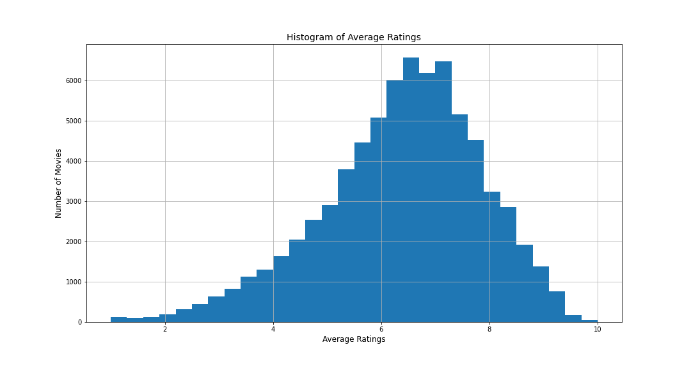

# MOVIE RECOMMENDATIONS FOR MICROSOFT's NEW MOVIE STUDIO

**Author**: [Jeremy Nguyo](https://github.com/NguyoJer)

## Business Problem

The role assumed here is of a Data Scientist working for Microsoft. Microsoft wants to get into the business of creating original video content thus they have created a new movie studio. Since Microsoft has no prior experience in video content creation, the task is to explore what types of films are currently doing the best at the box office and use this to help decide what type of films to create. In order to achieve this, I have to process data from different movie datasets and then translate those findings into actionable insights that the head of Microsoft's new movie studio can use. This will be achieved by answering the following research questions:

Question 1: How much should you spend on the production of a movie and which movies were the most profitable?
Question 2: Which movie genres are most commonly produced and how do they relate to their respective ratings?
Question 3: Which are the best months of the year to release a movie?

## Data Understanding

Datasets for the project were provided by Moringa School: [Moringa](https://moringaschool.com/courses/data-science-course/), as part of the Data Science course project. Copies of these datasets are stored in the 'zippedData' directory.  This includes data from Box Office Mojo, IMDB, Rotten Tomatoes, The Movie Database and The Numbers. It's worth noting that only datasets from IMDB and The Numbers were used. 

The IMDB database,im.db, consists of 8 tables but I only made use of two tables; movie_ratings and movie_basics.

The dataset I used from The Numbers is named as 'tn.movie_budgets.csv'. 

## Data Analysis

In my analysis we explore and answer the following questions:

#### Question 1: How much should you spend in the production of a movie and which movies were the most profitable?

I cleaned the dataframe and recalculated the 'production_budget' and 'worldwide_gross' amounts to factor in for inflation using the CPI library and assigned these values to the 'adj_production_budget' and 'adj_worldwide_gross' columns.

Moreover, I added two more columns to show values for the 'profit' and 'profit_margin(%). I also narrowed down the dataset to only analyze data for the years 2000 to 2019. 

I examined the overall trend of 'production_budget verse the profit_margin' of the top 500 most profitable movies to see if there's any correlation.

I also did a comparison of the production budget and profit of the top 50 most profitable movies to also gather insights for my final recommendation.

##### Question 2: Which movie genres are most commonly produced and how do they relate to their respective ratings?

To answer these questions, I used data from IMDB database and joined two tables namely: movie_ratings and movie_basics. 

To get the most popular movie genres, I grouped the data by genres and counted the number of movies for each genre. See the visual below

Additionally, I analyzed the ratings for all the movies by getting the frequency of each rating.

To add onto that, I compared the ratings of movies for each genre. This was achieved by grouping the genres and getting an average of the ratings. 

##### Question 3: Which are the best months of the year to release a movie?

The 'movie_budgets' dataframe from The Numbers was used to answer this question.

The 'release_date' column was converted to a 'datetime' format and the month was extracted and added to a new column 'release_month. 

I first analyzed the data to see which months had the highest movie releases. This was done by grouping the data by months and counting the number of movies released in each month. 

To further work on this data, I did an analysis of all the months and the profits made by movies released in their respective months. To do this, I grouped the data by month and calculated an average of profit for each movie by the respective month it was released.

## Recommendations
This analysis leads to three recommendations as follows:

###### Question 1: How much should you spend in the production of a movie and which movies were the most profitable?
Microsoft needs to spend 120million to 200million USD and expect an ROI of 300% and above.

###### Question 2: Which movie genres are most commonly produced and how do they relate to their respective ratings?
Microsoft should focus on the following top 5 movie genres based on popularity; Drama, Comedy, Documentary, Action and Horror in that order. It was noted that  the most common genres had only average ratings ,thus, a genre having a high popularity doesn't necessarily mean it will have the highest ratings.

###### Question 3: Which are the best months of the year to release a movie?
I recommend that the movies are released in May, June and July. This is where we have had the highest profit margins recorded. The reason why these particular months have the highest profits needs to be further investigated.

### Next Steps

Further analysis of these datasets could yield additional insights into the following questions:

1. Which movie genres have higher net profits?
2. Which actors and directors tend to add the most value?
3. What impact, if any, does runtime and movie rating have on Net Profit, Profit Margin and IMDb rating?

## For More Information

See the full analysis in the [Jupyter Notebook](./student.ipynb) or review this [presentation](presentation.pdf).
